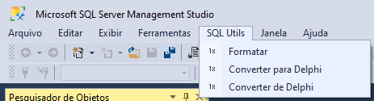

# SQLUtils

Simple SSMS extensions that alows you to format and convert to and from Delphi string.

# Instalation

Put all the files inside your SSMS 18 extensions folder

`C:\Program Files (x86)\Microsoft SQL Server Management Studio 18\Common7\IDE\Extensions\SQLUtils`
